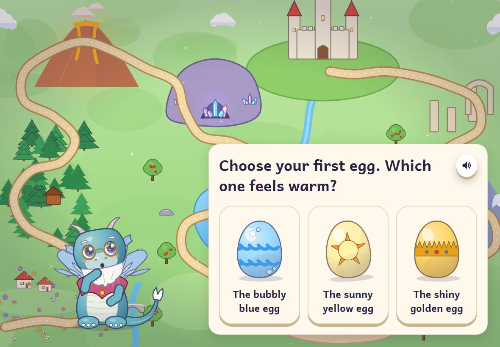
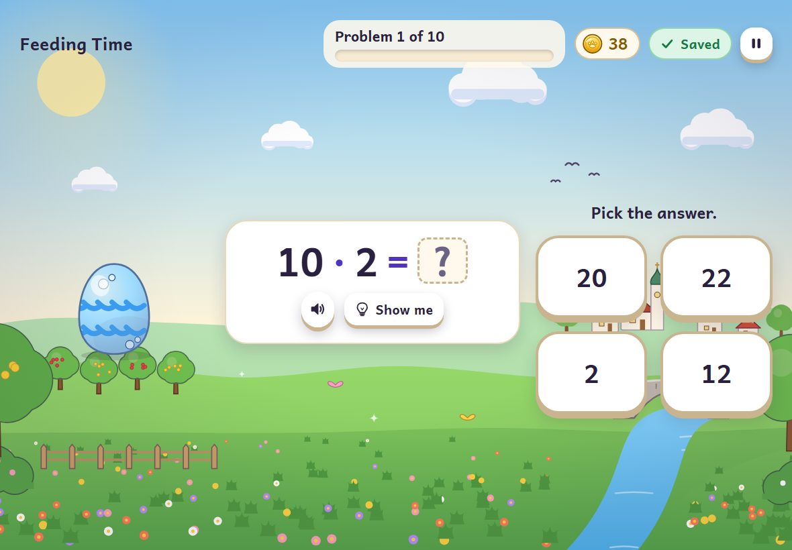
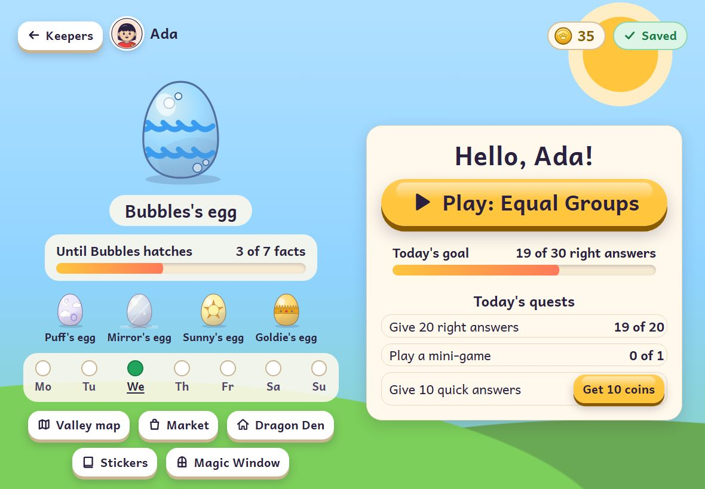
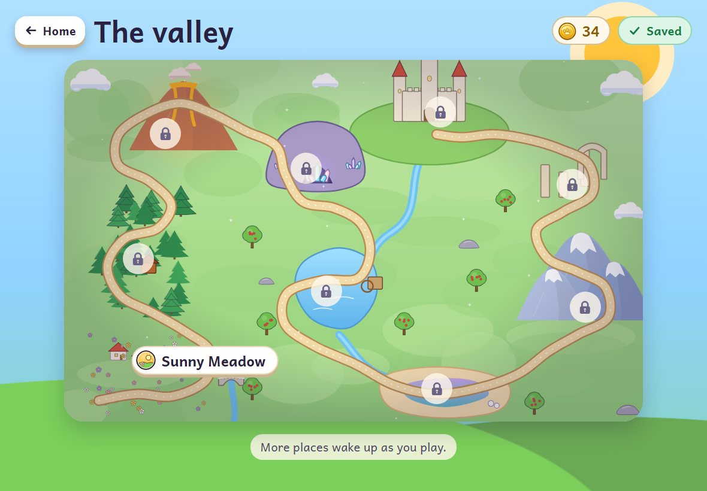

# Dragon Valley: A Times-Table Adventure

A colorful, offline-capable web game that helps 3rd graders master multiplication and division,
matched to the Czech primary-school math program (English UI, Czech notation `3 · 4 = 12`, `12 : 3 = 4`).

Hatch and raise a dragon for every times table, light up the Magic Window fact by fact, and help the
Seven-Headed Dragon in the finale.

**Play it at <https://rumukh.github.io/dragon-valley/>**: in any recent browser, best on a tablet in
landscape. A grown-up can install it for offline play from the grown-ups' area.

|  |          |
| :--------------------------------------------------------------------------------------------------------------------------------------: | :---------------------------------------------------------------------------------------------------------------------: |
|     |  |

## For grown-ups

- No accounts, no ads, no tracking: the game sends nothing anywhere and has no links out. The
  test suite checks this on every screen it visits.
- Progress stays in this browser on this device. Up to four children each have their own dragons,
  progress and settings, and the grown-ups' area (behind a hold-and-multiply gate) makes backups,
  restores them and installs the game for offline play.
- Problems are written the Czech school way (`3 · 4`, `12 : 3`, `23 : 5 = 4 r 3`) or the
  international way (`×`, `÷`, `R`), per child. Read-aloud uses only the voices on the device.
- Text up to 200 %, reduced motion, a keyboard for everything, and big touch targets: see
  [`docs/qa/accessibility.md`](docs/qa/accessibility.md).

Built as a standalone consumer of the [Aegis](https://github.com/rumukh/aegis-engine) action-driven SDK
(`@aegis/core`, `@aegis/runtime`, `@aegis/narrative`, `@aegis/browser`), vendored as pinned tarballs.

**Status:** version 1: all nine regions of the valley and the finale. The release checklist is
[`docs/qa/release.md`](docs/qa/release.md); the approved design and delivery plan is
[`docs/plan.md`](docs/plan.md).

## Documentation

| Document                                       | What it covers                                                                                     |
| ---------------------------------------------- | -------------------------------------------------------------------------------------------------- |
| [`docs/plan.md`](docs/plan.md)                 | The approved design and delivery plan                                                              |
| [`docs/design.md`](docs/design.md)             | The full game design: story, 9 regions and 59 levels, activities, adaptive engine, economy, UX     |
| [`docs/curriculum.md`](docs/curriculum.md)     | Czech 3rd-grade objectives, their levels and bosses, bounds, notation, glossary                    |
| [`docs/contract.md`](docs/contract.md)         | The domain contract: content pack, problems, state, actions, views, events, ownership              |
| [`docs/architecture.md`](docs/architecture.md) | Layers, command loop, saves, offline installation, child safety, build                             |
| [`docs/testing.md`](docs/testing.md)           | The gate, test discipline, goldens, learner bots, browser tests                                    |
| [`docs/app.md`](docs/app.md)                   | The browser application: screens, saves, input, audio, read-aloud, offline                         |
| [`docs/assets.md`](docs/assets.md)             | Art and audio pipelines, what ships, provenance rules                                              |
| [`docs/sdk-update.md`](docs/sdk-update.md)     | The pinned Aegis SDK and how to update it                                                          |
| [`docs/qa/`](docs/qa/)                         | Quality evidence: screens for review, defects, accessibility, coverage, performance, copy, release |

## Develop

Requirements: Node 24 and npm 11. On the corporate development machine npm goes through the proxy in
`.npmrc`; see [`docs/sdk-update.md`](docs/sdk-update.md) before changing dependencies.

```powershell
npm ci
npm run serve        # build, watch and serve at http://127.0.0.1:4320/ (refresh after "rebuilt")
npm run verify       # the gate: build, typecheck, lint, format, content, tests, lockfile
npm run test:e2e     # the browser QA suite through the system Edge (or Chrome: DV_BROWSER_CHANNEL=chrome)
npm run build -- --base /dragon-valley/   # the GitHub Pages build in dist-site/
```

After any `npm install`, run `npm run lockfile:fix` (the lockfile keeps public registry URLs so CI
can install).

## Layout

| Path            | What                                                                                      |
| --------------- | ----------------------------------------------------------------------------------------- |
| `src/rules/`    | Deterministic, DOM-free game rules and the domain contract (`contract/`)                  |
| `src/app/`      | Browser shell: DOM/SVG screens, audio, speech, saves, offline worker (`sw.ts`)            |
| `content/`      | Data: content pack, history of shipped packs, catalogs                                    |
| `assets/`       | Runtime art, audio and fonts with provenance                                              |
| `scripts/`      | Node tooling: build, serve, verify, content validation, lockfile                          |
| `test/`         | Vitest unit/trace/tooling tests and Playwright end-to-end tests (`e2e/`)                  |
| `vendor/aegis/` | The pinned SDK tarball set and its artifact manifest                                      |
| `docs/`         | Plan, design, curriculum, contract, architecture, testing, assets, SDK update, QA (`qa/`) |

## License

MIT. Fonts are OFL; art and audio carry recorded provenance (see `docs/assets.md`).
