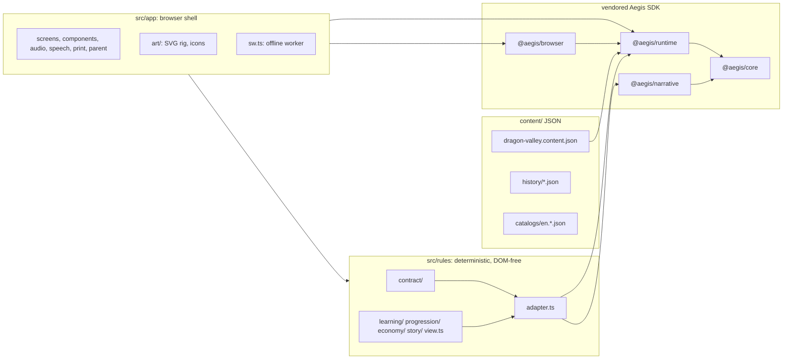

# Architecture

Dragon Valley is a static, offline-installable web app built as a **standalone consumer of the Aegis
action-driven SDK**. Authoritative game logic is deterministic and headless; the browser is a
presentation adapter. This document describes the layers, the data flow, persistence, offline
installation and the build. The domain types are in [contract.md](contract.md).

## 1. Layers



| Layer   | Path            | May use                                                                  | Must not use                                                                                                     |
| ------- | --------------- | ------------------------------------------------------------------------ | ---------------------------------------------------------------------------------------------------------------- |
| Rules   | `src/rules/**`  | `@aegis/core`, `@aegis/runtime`, `@aegis/narrative`, other rules modules | DOM, Node built-ins, `@aegis/browser`, `src/app`, clocks, `Math.random`, transcendental `Math`, locale functions |
| Shell   | `src/app/**`    | everything public in the SDK, the rules                                  | Node built-ins, three.js, the renderer, network beyond same-origin files                                         |
| Worker  | `src/app/sw.ts` | `@aegis/browser/offline`, `@aegis/browser/offline/worker`                | anything else                                                                                                    |
| Tooling | `scripts/**`    | Node, esbuild, the SDK                                                   | shipping to players                                                                                              |

TypeScript projects and ESLint enforce the boundaries: `src/rules` is type-checked with
`lib: ["ES2022"]` and no types (a `document` or `node:fs` reference is a type error), and ESLint
rejects forbidden imports and nondeterministic calls. The build refuses Node built-ins, three.js and
`@aegis/render-three` in any browser bundle.

## 2. The command loop

1. The shell renders the current `GameView` (screens never read state directly).
2. A control captures the view's revision when rendered. On activation it dispatches a `GameAction`
   with `{ expectedRevision }`.
3. `@aegis/runtime` validates the action, asks the adapter to `resolve` it (legality, turn cost),
   runs the command's `start`/`turn`/`finish` on a staged copy, drains due jobs, validates the new
   state, projects the view and publishes one commit atomically: `{ revision, turn, hash, view,
events, snapshot }`.
4. The checkpoint bridge persists that exact snapshot before the next substep (strict saves).
5. The shell re-renders from the new view and plays one-shot effects from the commit's events.

Invalid actions change nothing. Time enters only as payload data (`startSession.day`,
`answer.elapsedMs`), so a replay of the same actions on the same content and seed yields the same
hashes on every machine and browser.

## 3. Persistence and profiles

All storage is local IndexedDB through `@aegis/browser` (no accounts, no cloud):

| Record                      | `SaveService` game ID       | Profile ID         | Contents                                                             |
| --------------------------- | --------------------------- | ------------------ | -------------------------------------------------------------------- |
| Family record               | `dragon-valley-family`      | `family`           | up to four profiles: slot, name, avatar                              |
| Game save (one per child)   | `dragon-valley`             | `profile-1` … `-4` | the runtime snapshot, via `createSaveCheckpoint`                     |
| Preferences (one per child) | `dragon-valley-preferences` | `profile-1` … `-4` | notation, volumes, text size, reduced motion, read-aloud, time limit |

- Each game save is written through the **strict checkpoint bridge**: every commit is durable before
  the next substep; a failed write shows "not saved, retry" and the shell calls `retryCheckpoint`
  then `continuePending`, never re-dispatching the action (the labs' command-controller pattern).
- Invalid, future or incompatible saves show recovery screens (export the original bytes, import a
  backup, restore the previous copy, or a confirmed reset), never a silent new game.
- Saves pin their content revision. Upgrades restore with the archived pack from
  `content/history/` and activate the new pack at a hub boundary (contract §7.6).
- Browser storage can be evicted: the parent area offers backup export/import per child and requests
  `navigator.storage.persist()` when installing for offline use.

## 4. Offline installation

- `scripts/build.mjs` emits `resource-graph.json`: every shipped file with its exact byte count and
  SHA-256, validated at build time by the SDK's own `validateOfflinePack`. The graph's revision is a
  digest of the resource list.
- `index.html` declares the deployment base (`dv-base`) and the offline revision
  (`dv-offline-revision`); `sw.js` is bundled from the public `@aegis/browser/offline/worker` export
  with that revision pinned.
- "Install for offline play" (parent area) runs `OfflinePackStore.install(graph)` (all-or-nothing,
  digest-checked) and then `registerOfflineWorker('sw.js', base)`. The worker serves only the pinned,
  verified files, denies other requests, never calls `skipWaiting` and never forces a reload.
- A new deployment is a new revision. It is installed explicitly and activated at a safe boundary;
  saves migrate through content history (§3).
- Budgets: 32 MiB per file, 64 MiB per pack, at most 4096 files, no empty files.

## 5. Child safety and privacy

- A same-origin **Content-Security-Policy** in `index.html` (and sent by the dev server):
  `default-src 'self'`, no remote scripts, styles, fonts, images, media or connections, no objects,
  no form submission. Even a mistaken dependency cannot load a CDN or call home.
- No telemetry, analytics, ads, accounts, outbound links or embedded frames
  (`assertChildSafeView` checks views before mounting).
- Read-aloud uses only `localService` speech voices.
- Children's names live only in the family record on the device.

## 6. Build, deploy and the gate

| Command                                   | What it does                                                                                                                                 |
| ----------------------------------------- | -------------------------------------------------------------------------------------------------------------------------------------------- |
| `npm run build -- --base /dragon-valley/` | esbuild bundle of `src/app/main.ts` and the worker, copies content and runtime assets, writes and verifies the resource graph (`dist-site/`) |
| `npm run serve`                           | builds into `out/dev-site-*`, serves on loopback with the same CSP, rebuilds on change                                                       |
| `npm run verify`                          | the gate: build, typecheck (rules, app, worker, tests), lint, format, content validation, Vitest, lockfile                                   |
| `npm run test:e2e`                        | Playwright flows, accessibility and screenshots at the Pages base (system Edge/Chrome locally; three engines on CI)                          |

CI (`.github/workflows/ci.yml`) runs the gate on Ubuntu and Windows and audits its record in a
separate step; the e2e jobs run the browser suite (`docs/testing.md` §5), one job per engine (WebKit
in three parts). Pages
(`.github/workflows/pages.yml`) builds with base `/dragon-valley/`, re-checks the artifact and
deploys it. The SDK is a pinned, digest-checked tarball set (`docs/sdk-update.md`).

## 7. Repository layout

```
vendor/aegis/<version>/   SDK tarballs + artifacts.json (pinned, digest-checked)
content/                  content pack, history/, catalogs/
src/rules/                contract/, adapter.ts, learning/, progression/, economy/, story/, view.ts
src/app/                  main.ts, index.html, sw.ts, style.css (+ screens, components, art/, audio/, …)
assets/                   art/, backgrounds/, audio/, fonts/ (runtime files + provenance)
scripts/                  build, serve, verify, check-site, validate-content, canonicalise-lockfile, lib/
test/                     unit/, traces/, tooling/, e2e/ (+ sim/, migration/ later)
docs/                     plan, design, curriculum, contract, architecture, testing, assets, sdk-update
```
